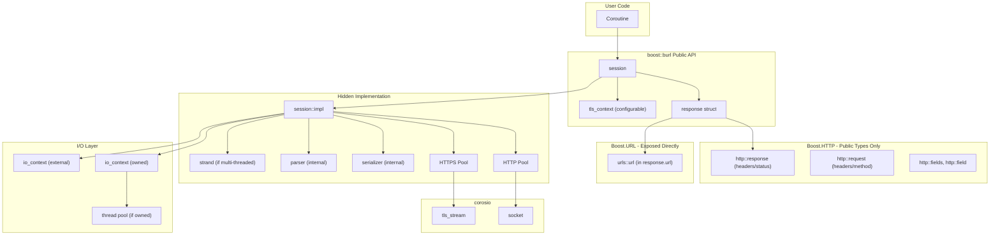

# Requests API io_context Integration Plan

## Architecture Overview

All HTTP operations flow through `burl::session`, which uses PIMPL to hide implementation details. The session can own its io_context (with internal threads) or use an external one. Uses **Boost.HTTP** internally for serialization/parsing (not exposed). Strand is used automatically for multi-threaded execution.




## Core Design Decisions

### 1. io_context Ownership and Threading

Session supports two modes of io_context management:

**Built-in Mode** - session owns io_context and manages threads:

```cpp
// Single-threaded (owns io_context, 1 thread)
burl::session s;

// Multi-threaded (owns io_context, N threads, uses strand)
burl::session s(burl::threads{4});
```

**External Mode** - user provides io_context:

```cpp
corosio::io_context ioc;

// Single-threaded (user runs ioc.run() on one thread)
burl::session s(ioc);

// Multi-threaded (user runs ioc.run() on multiple threads, session uses strand)
burl::session s(ioc, burl::multithreaded);
```

**Threading Configuration** (`include/boost/burl/session.hpp`):

```cpp
namespace boost {
namespace burl {

// Tag for multi-threaded external io_context
struct multithreaded_t {};
inline constexpr multithreaded_t multithreaded{};

// Thread count for built-in io_context
struct threads {
    unsigned count;
    explicit threads(unsigned n) : count(n) {}
};

} // namespace burl
} // namespace boost
```

### 2. TLS Context Access

Session provides access to the TLS context for certificate configuration:

```cpp
namespace boost {
namespace burl {

class session {
public:
    // Access TLS context for configuration (e.g., certificates, verification)
    corosio::ssl_context& tls_context();
    corosio::ssl_context const& tls_context() const;
    
    // Or provide a pre-configured TLS context
    void set_tls_context(std::shared_ptr<corosio::ssl_context> ctx);
};

} // namespace burl
} // namespace boost
```

**Example TLS configuration:**

```cpp
burl::session s;
auto& ctx = s.tls_context();
ctx.set_verify_mode(corosio::ssl::verify_peer);
ctx.load_verify_file("/path/to/ca-bundle.crt");
ctx.use_certificate_file("/path/to/client.crt");
ctx.use_private_key_file("/path/to/client.key");
```

### 3. PIMPL Session Design (boost::burl)

Session uses PIMPL to hide all implementation details including serializers/parsers. No top-level functions exist - all operations are session members.

**Public Header** (`include/boost/burl/session.hpp`):

```cpp
namespace boost {
namespace burl {

class session {
    struct impl;
    std::unique_ptr<impl> impl_;
    
public:
    // Built-in io_context (single-threaded)
    session();
    
    // Built-in io_context (multi-threaded, uses strand)
    explicit session(threads t);
    
    // External io_context (single-threaded)
    explicit session(corosio::io_context& ioc);
    
    // External io_context (multi-threaded, uses strand)
    session(corosio::io_context& ioc, multithreaded_t);
    
    ~session();
    
    session(session&&) noexcept;
    session& operator=(session&&) noexcept;
    
    // Run the internal io_context (only for built-in mode)
    // Blocks until all work completes
    void run();
    
    // TLS context access
    corosio::ssl_context& tls_context();
    corosio::ssl_context const& tls_context() const;
    void set_tls_context(std::shared_ptr<corosio::ssl_context> ctx);
    
    // HTTP methods - all return capy::io_task<response>
    capy::io_task<response> request(http::method method, urls::url_view url, request_options opts = {});
    capy::io_task<response> get(urls::url_view url, request_options opts = {});
    capy::io_task<response> post(urls::url_view url, request_options opts = {});
    capy::io_task<response> put(urls::url_view url, request_options opts = {});
    capy::io_task<response> patch(urls::url_view url, request_options opts = {});
    capy::io_task<response> delete_(urls::url_view url, request_options opts = {});
    capy::io_task<response> head(urls::url_view url, request_options opts = {});
    capy::io_task<response> options(urls::url_view url, request_options opts = {});
    
    // Configuration accessors
    http::fields& headers();
    cookie_jar& cookies();
    void set_auth(std::shared_ptr<auth_base> auth);
    void set_verify(verify_config v);
    void set_max_redirects(int n);
    
    void close();
};

} // namespace burl
} // namespace boost
```

### 2. Multi-Level Body API Design

Bodies are handled at multiple levels using `capy::any_buffer_source` (response) and `capy::any_buffer_sink` (request) for streaming, with higher-level APIs for common use cases.

#### Low-Level Streaming API

```cpp
namespace boost {
namespace burl {

// Response with streaming body access
struct streamed_response {
    http::response message;                 // Headers + status (direct use)
    capy::any_buffer_source body;           // Streaming body source
    urls::url url;                          // Final URL after redirects
};

// For streaming requests
struct streamed_request {
    http::request message;                  // Headers + method + target
    capy::any_buffer_sink body;             // Streaming body sink
};

} // namespace burl
} // namespace boost
```

#### High-Level Buffered API (Default)

```cpp
namespace boost {
namespace burl {

// Response with body accumulated into container (default: string)
template<class Body = std::string>
struct response {
    http::response message;                 // Headers + status (direct use)
    Body body;                              // Body in caller's chosen container
    urls::url url;                          // Final URL after redirects
    std::chrono::milliseconds elapsed{0};   // Request duration
    std::vector<response<Body>> history;    // Redirect history
    
    // Convenience accessors (delegate to message)
    http::status status() const noexcept { return message.status(); }
    unsigned short status_int() const noexcept { return message.status_int(); }
    core::string_view reason() const noexcept { return message.reason(); }
    bool ok() const noexcept { return message.status_int() < 400; }
    
    // Body as string_view (when Body supports it)
    core::string_view text() const noexcept 
        requires requires { core::string_view{body}; }
    { return body; }
    
    // Redirect check
    bool is_redirect() const noexcept;
    
    // Throws http_error if status >= 400
    void raise_for_status() const;
};

// Alias for common case
using string_response = response<std::string>;

} // namespace burl
} // namespace boost
```

#### JSON and Custom Deserialization (Customization Point)

```cpp
namespace boost {
namespace burl {

// Tag types for body handling
struct as_string_t {};
struct as_json_t {};
template<class T> struct as_type_t {};

inline constexpr as_string_t as_string{};
inline constexpr as_json_t as_json{};
template<class T> inline constexpr as_type_t<T> as_type{};

// Session methods with body type specification
class session {
public:
    // Default: body as string
    capy::io_task<response<std::string>> 
    get(urls::url_view url, request_options opts = {});
    
    // Explicit string body
    capy::io_task<response<std::string>> 
    get(urls::url_view url, as_string_t, request_options opts = {});
    
    // JSON body (parses into json::value)
    capy::io_task<response<json::value>> 
    get(urls::url_view url, as_json_t, request_options opts = {});
    
    // Custom type via Boost.Describe or reflection
    template<class T>
    capy::io_task<response<T>> 
    get(urls::url_view url, as_type_t<T>, request_options opts = {});
    
    // Streaming (no body accumulation)
    capy::io_task<streamed_response> 
    get_streamed(urls::url_view url, request_options opts = {});
};

} // namespace burl
} // namespace boost
```

**Key design points:**

- `http::response message` - used directly, not wrapped
- `urls::url url` - Boost.URL type exposed directly  
- Streaming via `capy::any_buffer_source` / `capy::any_buffer_sink`
- Default body type is `std::string`
- `as_json` tag parses response into `json::value`
- `as_type<T>` parses into user's struct (via Boost.Describe/reflection)
- Headers accessed via `response.message.at(http::field::content_type)` etc.

### 4. Implementation Structure

**Implementation** (`src/session.cpp`):

```cpp
struct session::impl {
    // io_context ownership
    std::unique_ptr<corosio::io_context> owned_ioc_;  // null if external
    corosio::io_context& ioc_;                         // reference to active ioc
    
    // Threading
    std::vector<std::thread> threads_;                 // empty if external ioc
    bool multithreaded_ = false;
    
    // Executor - strand if multi-threaded, plain executor otherwise
    using executor_type = std::variant<
        corosio::io_context::executor_type,
        corosio::io_context::strand>;
    executor_type executor_;
    
    // TLS context (always created, can be replaced)
    std::shared_ptr<corosio::ssl_context> ssl_ctx_;
    
    // Configuration
    http::fields default_headers_;
    cookie_jar cookies_;
    std::shared_ptr<auth_base> auth_;
    verify_config verify_ = true;
    int max_redirects_ = 30;
    
    // Connection pools keyed by (host, port, is_https)
    struct pool_key {
        std::string host;
        std::uint16_t port;
        bool https;
        auto operator<=>(pool_key const&) const = default;
    };
    
    struct connection {
        std::unique_ptr<corosio::socket> socket;
        std::unique_ptr<corosio::tls_stream> tls;
        
        corosio::io_stream& stream() {
            return tls ? static_cast<corosio::io_stream&>(*tls) 
                       : static_cast<corosio::io_stream&>(*socket);
        }
    };
    
    std::map<pool_key, std::vector<std::unique_ptr<connection>>> pools_;
    
    // Constructors for different modes
    impl();                                           // built-in single-threaded
    explicit impl(unsigned thread_count);             // built-in multi-threaded
    explicit impl(corosio::io_context& ioc);          // external single-threaded
    impl(corosio::io_context& ioc, bool multi);       // external multi-threaded
    
    ~impl();  // joins threads if owned
    
    // Get executor (strand or plain, depending on threading mode)
    auto get_executor() {
        return std::visit([](auto& ex) { return ex; }, executor_);
    }
    
    capy::io_task<response> do_request(http::request& req, request_options const& opts);
    capy::io_task<connection*> acquire_connection(boost::urls::url_view url);
    void release_connection(pool_key const& key, std::unique_ptr<connection> conn);
};

// Constructor implementations
session::impl::impl()
    : owned_ioc_(std::make_unique<corosio::io_context>())
    , ioc_(*owned_ioc_)
    , multithreaded_(false)
    , executor_(ioc_.get_executor())
    , ssl_ctx_(std::make_shared<corosio::ssl_context>())
{
}

session::impl::impl(unsigned thread_count)
    : owned_ioc_(std::make_unique<corosio::io_context>())
    , ioc_(*owned_ioc_)
    , multithreaded_(thread_count > 1)
    , executor_(multithreaded_ 
        ? executor_type{corosio::io_context::strand(ioc_)}
        : executor_type{ioc_.get_executor()})
    , ssl_ctx_(std::make_shared<corosio::ssl_context>())
{
    threads_.reserve(thread_count);
    for (unsigned i = 0; i < thread_count; ++i)
        threads_.emplace_back([this] { ioc_.run(); });
}

session::impl::impl(corosio::io_context& ioc)
    : ioc_(ioc)
    , multithreaded_(false)
    , executor_(ioc_.get_executor())
    , ssl_ctx_(std::make_shared<corosio::ssl_context>())
{
}

session::impl::impl(corosio::io_context& ioc, bool multi)
    : ioc_(ioc)
    , multithreaded_(multi)
    , executor_(multi 
        ? executor_type{corosio::io_context::strand(ioc_)}
        : executor_type{ioc_.get_executor()})
    , ssl_ctx_(std::make_shared<corosio::ssl_context>())
{
}

session::impl::~impl() {
    if (owned_ioc_)
        owned_ioc_->stop();
    for (auto& t : threads_)
        if (t.joinable())
            t.join();
}
```

### 5. Internal Protocol Handling (Hidden)

Boost.HTTP serializers and parsers are used **internally only** - not exposed in the public API. The implementation uses them to serialize requests and parse responses:

```cpp
// Internal implementation details - not in public headers
namespace detail {

// Request serialization (internal)
capy::io_task<> send_request(connection& conn, http::request const& req);

// Response parsing (internal)  
capy::io_task<> read_response(connection& conn, response& resp);

// Request building (internal)
http::request build_request(
    http::method method,
    boost::urls::url_view url,
    http::fields const& default_headers,
    request_options const& opts);

} // namespace detail
```

**Key point:** Users interact with `http::request`, `http::response`, `http::fields`, `http::field`, `http::method`, and `http::status` - these are data structures. The serializers and parsers that convert these to/from wire format are implementation details.

### 7. URL Parsing with Boost.URL

```cpp
#include <boost/url.hpp>

capy::io_task<connection*> session::impl::acquire_connection(boost::urls::url_view url) {
    pool_key key{
        std::string(url.host()),
        url.has_port() ? url.port_number() : (url.scheme_id() == boost::urls::scheme::https ? 443 : 80),
        url.scheme_id() == boost::urls::scheme::https
    };
    // ... acquire or create connection
}
```

### 8. Redirect Handling (HTTP <-> HTTPS)

```cpp
capy::io_task<response> session::impl::do_request(http::request& req, request_options const& opts) {
    int redirects = 0;
    response resp;
    boost::urls::url current_url(req.target());
    
    while (true) {
        auto* conn = co_await acquire_connection(current_url);
        
        co_await send_request(*conn, req);
        auto ec = co_await read_response(*conn, resp);
        if (ec.failed())
            co_return ec;
        
        if (!resp.is_redirect() || redirects >= max_redirects_) {
            release_connection(make_key(current_url), conn);
            resp.url_ = current_url.buffer();
            co_return resp;
        }
        
        // Handle redirect
        auto location = resp.header(http::field::location);
        auto new_url = boost::urls::resolve(current_url, 
            boost::urls::parse_uri_reference(location).value());
        
        // If scheme changed, discard connection
        bool scheme_changed = current_url.scheme() != new_url.scheme();
        if (!scheme_changed)
            release_connection(make_key(current_url), conn);
        
        // Rebuild request for new URL
        req.set_target(new_url.encoded_resource());
        req.set(http::field::host, new_url.encoded_host());
        
        // POST -> GET on 303, etc.
        if (resp.status() == http::status::see_other)
            req.set_method(http::method::get);
        
        resp.history_.push_back(std::move(resp));
        resp = response{};
        current_url = new_url;
        ++redirects;
    }
}
```

### 9. Task Type: capy::io_task

All async operations use `capy::io_task<T>` which wraps `capy::task<io_result<T>>`:

```cpp
// In namespace boost::burl
capy::io_task<response> session::get(std::string_view url, request_options opts) {
    auto parsed = urls::parse_uri(url);
    if (parsed.has_error())
        co_return make_error_code(parsed.error());
    
    auto req = impl_->build_request(http::method::get, *parsed, opts);
    co_return co_await impl_->do_request(req, opts);
}
```

## File Organization

Repository: `C:\Users\Vinnie\src\boost\libs\burl`

```
include/boost/burl/
    session.hpp       # Public session class with PIMPL
    response.hpp      # response<Body> template, streamed_response
    options.hpp       # request_options, timeout, verify_config
    auth.hpp          # auth_base, http_basic_auth, http_digest_auth
    cookies.hpp       # cookie_jar, cookie
    error.hpp         # error codes, http_error exception
    fwd.hpp           # Forward declarations
    body_tags.hpp     # as_string, as_json, as_type<T> tags

src/
    session.cpp       # session::impl stub with implementation notes

test/
    session.cpp       # Unit tests for session compilation
    response.cpp      # Unit tests for response types
    options.cpp       # Unit tests for options/config
    auth.cpp          # Unit tests for auth types
    cookies.cpp       # Unit tests for cookie_jar

example/
    usage.cpp         # Compilable examples demonstrating all API features
```

**Note:** Boost.HTTP and Boost.URL types appear directly in the public API:

- `http::response` in `burl::response::message`
- `urls::url` in `burl::response::url`
- `http::field`, `http::status`, `http::method` used throughout
- `urls::params_view`, `urls::segments_view` accessible via `response.url`

## Implementation Scope

**Phase 1 (This Plan):** Create API skeleton

- All public headers with complete declarations
- Function definitions with `// TODO:` implementation notes
- Unit tests that verify compilation (not functionality)
- Compilable usage examples

**Phase 2 (Future):** Implement functionality

- Connection pooling logic
- HTTP serialization/parsing
- TLS integration
- Redirect handling

## Dependencies

- `boost::corosio` - `io_context`, `socket`, `tls_stream`, `ssl_context`, `strand`
- `boost::capy` - `io_task`, `task`, `io_result`, `any_buffer_source`, `any_buffer_sink`
- `boost::url` - URL parsing (`urls::url`, `urls::url_view`, `urls::parse_uri`)
- `boost::http` - Public types: `request`, `response`, `fields`, `field`, `method`, `status`
- `boost::http` (internal only) - `serializer`, `response_parser` (not exposed in API)
- `boost::json` - For `as_json` body parsing
- `boost::describe` - For `as_type<T>` deserialization

## Example Usage

### Built-in io_context (Simple API)

```cpp
#include <boost/burl/session.hpp>

int main() {
    // Single-threaded with built-in io_context
    burl::session s;
    
    // Configure TLS (optional)
    s.tls_context().load_verify_file("/etc/ssl/certs/ca-certificates.crt");
    
    // Spawn a coroutine and run
    s.spawn([&]() -> capy::io_task<> {
        auto [ec, r] = co_await s.get("https://api.github.com/users/octocat");
        if (r.ok())
            std::cout << r.text() << "\n";
        co_return {};
    }());
    
    s.run();  // Blocks until complete
}
```

### Built-in io_context (Multi-threaded)

```cpp
int main() {
    // Multi-threaded with 4 threads (uses strand internally)
    burl::session s(burl::threads{4});
    
    s.spawn([&]() -> capy::io_task<> {
        // Multiple concurrent requests - strand ensures thread safety
        auto [ec1, r1] = co_await s.get("https://api.example.com/a");
        auto [ec2, r2] = co_await s.get("https://api.example.com/b");
        co_return {};
    }());
    
    s.run();
}
```

### External io_context (Single-threaded)

```cpp
#include <boost/corosio/io_context.hpp>
#include <boost/burl/session.hpp>

int main() {
    corosio::io_context ioc;
    burl::session s(ioc);  // Single-threaded
    
    ioc.spawn([&]() -> capy::io_task<> {
        auto [ec, r] = co_await s.get("https://api.github.com/users/octocat");
        co_return {};
    }());
    
    ioc.run();  // User controls the event loop
}
```

### External io_context (Multi-threaded)

```cpp
int main() {
    corosio::io_context ioc;
    burl::session s(ioc, burl::multithreaded);  // Uses strand
    
    ioc.spawn([&]() -> capy::io_task<> {
        auto [ec, r] = co_await s.get("https://api.github.com/users/octocat");
        co_return {};
    }());
    
    // User runs multiple threads
    std::vector<std::thread> threads;
    for (int i = 0; i < 4; ++i)
        threads.emplace_back([&] { ioc.run(); });
    for (auto& t : threads)
        t.join();
}
```

### Full Example with All Features

```cpp
capy::io_task<> do_requests(burl::session& s) {
    // Simple GET - default body as string
    auto [ec, r] = co_await s.get("https://api.github.com/users/octocat");
    if (ec.failed())
        co_return ec;
    
    if (r.ok()) {
        std::cout << r.text() << std::endl;
    }
    
    // Access headers directly via http::response
    if (r.message.exists(http::field::content_type))
        std::cout << "Content-Type: " << r.message.at(http::field::content_type) << "\n";
    
    // Access URL components via urls::url
    std::cout << "Host: " << r.url.host() << "\n";
    for (auto param : r.url.params())
        std::cout << param.key << "=" << param.value << "\n";
    
    // GET with JSON parsing
    auto [ec2, jr] = co_await s.get("https://api.example.com/data", burl::as_json);
    if (jr.ok()) {
        std::cout << jr.body.at("name").as_string() << "\n";
    }
    
    // GET with custom type deserialization
    struct User {
        std::string login;
        int id;
    };
    auto [ec3, user_r] = co_await s.get("https://api.github.com/users/octocat", 
                                         burl::as_type<User>);
    if (user_r.ok()) {
        std::cout << user_r.body.login << " (id: " << user_r.body.id << ")\n";
    }
    
    // Streaming response (large downloads)
    auto [ec4, sr] = co_await s.get_streamed("https://example.com/large-file");
    if (!ec4.failed()) {
        capy::const_buffer arr[16];
        while (true) {
            auto [err, count] = co_await sr.body.pull(arr, 16);
            if (err || count == 0) break;
            sr.body.consume(count);
        }
    }
    
    // POST with JSON body
    burl::request_options opts;
    opts.json = R"({"name": "test"})";
    opts.headers.set(http::field::authorization, "Bearer token");
    
    auto [ec5, r5] = co_await s.post("https://api.example.com/data", opts);
    
    co_return {};
}
```

## Header Details

### `fwd.hpp`

```cpp
namespace boost::burl {
class session;
template<class Body = std::string> struct response;
struct streamed_response;
struct request_options;
struct verify_config;
class cookie_jar;
struct cookie;
class auth_base;
// ...
}
```

### `error.hpp`

```cpp
namespace boost::burl {
enum class error {
    invalid_url,
    connection_failed,
    tls_handshake_failed,
    timeout,
    too_many_redirects,
    // ...
};
system::error_code make_error_code(error e);

class http_error : public std::exception {
    // Thrown by raise_for_status() when status >= 400
};
}
```

### `body_tags.hpp`

```cpp
namespace boost::burl {
struct as_string_t {};
struct as_json_t {};
template<class T> struct as_type_t {};

inline constexpr as_string_t as_string{};
inline constexpr as_json_t as_json{};
template<class T> inline constexpr as_type_t<T> as_type{};
}
```

### `options.hpp`

```cpp
namespace boost::burl {
struct multithreaded_t {};
inline constexpr multithreaded_t multithreaded{};

struct threads {
    unsigned count;
    explicit threads(unsigned n) : count(n) {}
};

struct verify_config {
    bool verify_peer = true;
    std::string ca_file;
    std::string ca_path;
};

struct request_options {
    std::optional<http::fields> headers;
    std::optional<std::string> json;
    std::optional<std::string> data;
    std::optional<std::chrono::milliseconds> timeout;
    std::optional<int> max_redirects;
    // ...
};
}
```

### Stub Implementation Pattern

Function definitions in `session.cpp` should follow this pattern:

```cpp
capy::io_task<response<std::string>>
session::get(urls::url_view url, request_options opts) {
    // TODO: Implementation steps:
    // 1. Validate URL has http/https scheme
    // 2. Acquire connection from pool (or create new)
    // 3. Build http::request with headers from opts and defaults
    // 4. Serialize request via http::serializer (internal)
    // 5. Read response via http::response_parser (internal)
    // 6. Handle redirects if needed (up to max_redirects)
    // 7. Accumulate body into std::string
    // 8. Return connection to pool
    // 9. Return response with elapsed time
    
    co_return {make_error_code(error::not_implemented), {}};
}
```

## Open Questions

1. Connection pool size limits and idle timeout?
2. Should `request_options.headers` be `http::fields` or `http::request` directly?
3. Should session have a `spawn()` method or should users use `ioc.spawn()` directly?
4. Graceful shutdown: how to drain in-flight requests when closing session?

